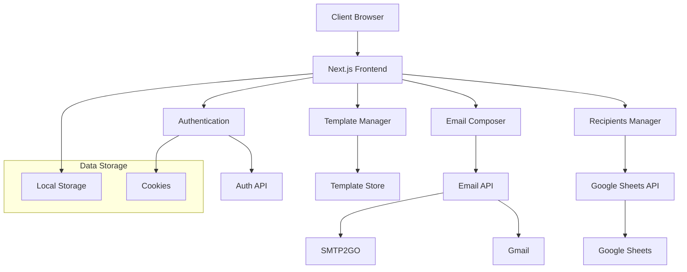

# JLUG Mail Forge

A powerful email marketing platform built with Next.js that allows you to manage email campaigns, templates, and recipients efficiently.

## Preview Video

https://github.com/user-attachments/assets/22d7e9d1-79b0-4e23-923e-6647a5d208f0

---


## System Architecture



## Features

- 📧 Multi-provider email support (Gmail, SMTP2GO)
- 📝 Rich text editor with template variables
- 📊 Google Sheets integration for recipient management
- 💾 Draft saving functionality
- 📱 Responsive design
- 🔍 Preview and review emails before sending
- 📋 Template management system
- 📈 Campaign tracking and analytics

## Tech Stack

- **Framework**: Next.js 15
- **UI Components**: Custom components with Radix UI, Shadcn UI
- **Styling**: Tailwind CSS
- **Animations**: Framer Motion
- **Rich Text Editor**: React Email
- **Templates**: React Email
- **State Management**: Zustand
- **API Integration**: Google Sheets API

## Getting Started

### Prerequisites

- Node.js 18+ 
- Google Cloud Platform account with Sheets API enabled
- Email provider credentials (Gmail/SMTP2GO)

### Installation

1. Clone the repository:
```bash
git clone <repository-url>
cd jlug-mail-forge
```

2. Install dependencies:
```bash
pnpm install
```

3. Create a `.env` file in the root directory:
```env
SENDER_EMAIL="email from smtp2go"
SENDER_PASSWORD="password from smtp2go"
SMTP2GO_API_KEY=your_smtp2go_key
GOOGLE_SHEETS_API_KEY=your_api_key
VERCEL_URL="URL FOR HOSTING TEMPLATE IMAGES"
ADMIN_USERNAME="admin_username"
ADMIN_PASSWORD="admin_password"
```

4. Start the development server:
```bash
pnpm dev
```

The application will be available at `http://localhost:3000`

## Project Structure

jlug-mail-forge/
├── app/                # Next.js app directory
│   ├── actions/        # Server actions
│   ├── compose/        # Email composition page
│   └── login/          # Mock Authentication page
├── components/         # React components
│   ├── composer/       # Email composer components
│   ├── email/         # Email preview components
│   └── ui/            # Shared UI components
├── lib/               # Utility functions
└── store/             # State management

## Usage

1. **Recipients Management**
   - Import recipients from Google Sheets
   - Filter and select recipients
   - Manage recipient fields

2. **Email Composition**
   - Rich text editing
   - Template variable insertion
   - File attachments
   - Preview functionality

3. **Template Management**
   - Create reusable templates
   - Edit existing templates
   - Delete unused templates

4. **Campaign Tracking**
   - View sent campaigns
   - Track delivery status
   - Monitor engagement

## Contributing

1. Fork the repository
2. Create your feature branch (`git checkout -b feature/amazing-feature`)
3. Commit your changes (`git commit -m 'Add some amazing feature'`)
4. Push to the branch (`git push origin feature/amazing-feature`)
5. Open a Pull Request

## License

This project is licensed under the MIT License - see the LICENSE file for details.

 
